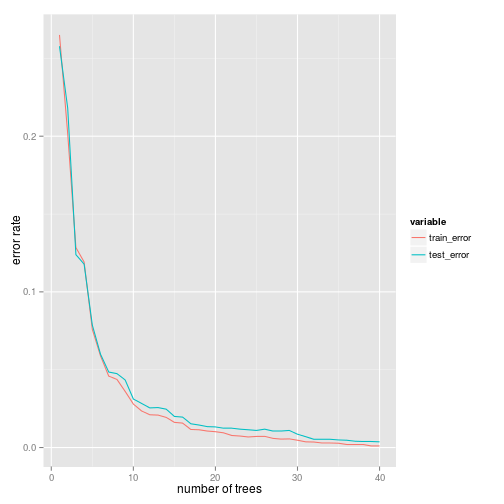

# Practical Machine Learning Course Project


```r
library(adabag)  # for boosting
library(ggplot2) # for plotting
library(reshape) # for reshape data
options(warn=-1)
```

## 1. Read in and process data

```r
makedata <- function(X)
{
for(i in 7:159) 
  if(is.factor(X[[i]]))
    X[[i]]<-as.numeric(as.character(X[[i]]))
X[6:ncol(X)]
}

# Read in data and drop time stamp variables
train <- makedata(read.csv("pml-training.csv"))
test  <- makedata(read.csv("pml-testing.csv"))

# Remove variables that are all "NA"s
keep <- sapply(train, function(x) !all(is.na(x)))
train <- train[sample(1:nrow(train)), keep]
test  <- test[, keep]
```

## 2. Training the boosting algorithm
The multiclass boosting algorithm (adabag package) is used. Shallow trees are used as week classifers, which has the advantage of handling missing values well. The number of trees is estimated by a validation set. 

```r
# Estimate the number of trees by a validation set
set.seed(12321)
n <- nrow(train)
ind <- sample(1:n, round(0.25*n))
X <-train[-ind,]
Y <-train[ind,]
num_trees <- 40
fit <- boosting(classe~., data=X, boos=TRUE, mfinal=num_trees)
evol_X <- errorevol(fit, X)
evol_Y <- errorevol(fit, Y)
```
Here's a plot of training and validation errors. It looks like 35 is a good number of trees to use.

```r
points <- data.frame(num_trees=1:num_trees, train_error=evol_X$error, test_error=evol_Y$error)
points <- melt(points, id.vars="num_trees")
g <- ggplot(points, aes(x=num_trees,y=value,colour=variable)) + 
   geom_line() + xlab("number of trees") + ylab("error rate")
print(g)
```

 

## 3. Estimate the out of sample error
A 5-fold cross validation is used here. Based on the previous plot, we should expect a small error rate. 

The output shows the confusion matrix and estimated error rate. 

```r
fit <- boosting.cv(classe~., data=train, v=5, boos=TRUE, mfinal=35)
```

```
## i:  1 Sat Sep 20 23:35:42 2014 
## i:  2 Sat Sep 20 23:38:55 2014 
## i:  3 Sat Sep 20 23:42:17 2014 
## i:  4 Sat Sep 20 23:45:35 2014 
## i:  5 Sat Sep 20 23:48:44 2014
```

```r
print(fit$confusion)
```

```
##                Observed Class
## Predicted Class    A    B    C    D    E
##               A 5576   12    0    0    0
##               B    2 3769    7    3    5
##               C    0   13 3409   27    2
##               D    1    2    6 3183    9
##               E    1    1    0    3 3591
```

```r
print(fit$error)
```

```
## [1] 0.004791
```

## 4. Predicting on the test set

```r
fit <- boosting(classe~., data=train, boos=TRUE, mfinal=35)

# apparently, this implementation demands that 
# train and test sets must be in exactly same format
# so this is just to fix the format
test_ <- rbind(train, cbind(test[, 1:148],data.frame(classe=NA)))
test_ <- test_[-(1:nrow(train)),]

# actually predicts! yay!
pred <- predict(fit, test_)
print(pred$class)
```

```
##  [1] "B" "A" "B" "A" "A" "E" "D" "B" "A" "A" "B" "C" "B" "A" "E" "E" "A"
## [18] "B" "B" "B"
```
